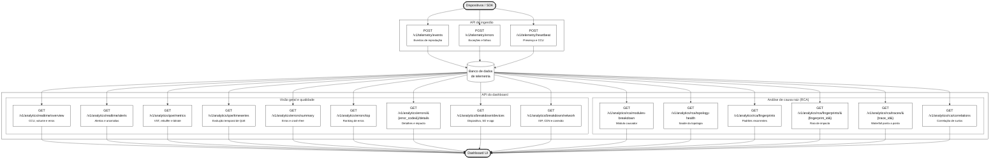

# Documentação do Backend

## Endpoints de telemetria

## Fluxograma dos endpoints

```mermaid
flowchart TB
    dispositivos([Dispositivos / SDK])

    subgraph ingestao[API de ingestão]
        direction LR
        events[POST<br/>/v1/telemetry/events<br/><small>Eventos de reprodução</small>]
        errors[POST<br/>/v1/telemetry/errors<br/><small>Exceções e falhas</small>]
        heartbeat[POST<br/>/v1/telemetry/heartbeat<br/><small>Presença e CCU</small>]
    end

    banco[(Banco de dados<br/>de telemetria)]

    subgraph analytics[API do dashboard]
        direction TB

        subgraph visao[Visão geral e qualidade]
            direction LR
            overview[GET<br/>/v1/analytics/realtime/overview<br/><small>CCU, volume e erros</small>]
            alerts[GET<br/>/v1/analytics/realtime/alerts<br/><small>Alertas e anomalias</small>]
            qoe_metrics[GET<br/>/v1/analytics/qoe/metrics<br/><small>VST, rebuffer e bitrate</small>]
            qoe_timeseries[GET<br/>/v1/analytics/qoe/timeseries<br/><small>Evolução temporal de QoE</small>]
            error_summary[GET<br/>/v1/analytics/errors/summary<br/><small>Erros e crash-free</small>]
            error_top[GET<br/>/v1/analytics/errors/top<br/><small>Ranking de erros</small>]
            error_details[GET<br/>/v1/analytics/errors/&#123;error_code&#125;/details<br/><small>Detalhes e impacto</small>]
            devices[GET<br/>/v1/analytics/breakdown/devices<br/><small>Dispositivo, SO e app</small>]
            network[GET<br/>/v1/analytics/breakdown/network<br/><small>ISP, CDN e conexão</small>]
        end

        subgraph rca["Análise de causa raiz (RCA)"]
            direction LR
            modules[GET<br/>/v1/analytics/rca/modules-breakdown<br/><small>Módulo causador</small>]
            topology[GET<br/>/v1/analytics/rca/topology-health<br/><small>Saúde da topologia</small>]
            fingerprints[GET<br/>/v1/analytics/rca/fingerprints<br/><small>Padrões recorrentes</small>]
            fingerprint_details[GET<br/>/v1/analytics/rca/fingerprints/&#123;fingerprint_id&#125;<br/><small>Raio de impacto</small>]
            traces[GET<br/>/v1/analytics/rca/traces/&#123;trace_id&#125;<br/><small>Waterfall ponta a ponta</small>]
            correlations[GET<br/>/v1/analytics/rca/correlations<br/><small>Correlação de surtos</small>]
        end
    end

    dashboard([Dashboard UI])

    dispositivos --> events
    dispositivos --> errors
    dispositivos --> heartbeat
    events --> banco
    errors --> banco
    heartbeat --> banco

    banco --> overview
    banco --> alerts
    banco --> qoe_metrics
    banco --> qoe_timeseries
    banco --> error_summary
    banco --> error_top
    banco --> error_details
    banco --> devices
    banco --> network
    banco --> modules
    banco --> topology
    banco --> fingerprints
    banco --> fingerprint_details
    banco --> traces
    banco --> correlations

    overview --> dashboard
    alerts --> dashboard
    qoe_metrics --> dashboard
    qoe_timeseries --> dashboard
    error_summary --> dashboard
    error_top --> dashboard
    error_details --> dashboard
    devices --> dashboard
    network --> dashboard
    modules --> dashboard
    topology --> dashboard
    fingerprints --> dashboard
    fingerprint_details --> dashboard
    traces --> dashboard
    correlations --> dashboard

    classDef default fill:#fff,stroke:#222,stroke-width:1px,color:#111;
    classDef actor fill:#eee,stroke:#111,stroke-width:2px,color:#111;
    class dispositivos,dashboard actor;
    style ingestao fill:#fff,stroke:#222,stroke-width:1px;
    style analytics fill:#fff,stroke:#222,stroke-width:1px;
    style visao fill:#fff,stroke:#555,stroke-width:1px;
    style rca fill:#fff,stroke:#555,stroke-width:1px;
```
